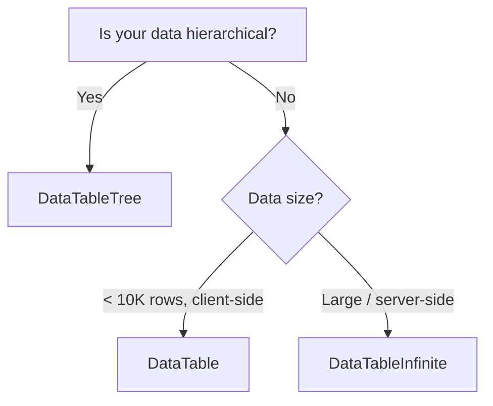

# Table Variants

The data-grid ships three table components, each built for a different data pattern. All three share the same filter controls, toolbar, and BYOS state system.

---

## Comparison

| Feature                  |  `DataTable`   | `DataTableInfinite` | `DataTableTree` |
| ------------------------ | :------------: | :-----------------: | :-------------: |
| Pagination               | ✅ Client-side | ❌ Infinite scroll  | ✅ Client-side  |
| Server-side data         |    Optional    |     ✅ Required     |    Optional     |
| Row selection            |    ✅ Multi    |      ✅ Single      |    ✅ Multi     |
| Column resizing          |       ❌       |     ✅ CSS vars     |       ❌        |
| Column reordering (drag) |       ❌       |     ✅ dnd-kit      |       ❌        |
| Row detail sheet         |    Optional    |     ✅ Built-in     |    Optional     |
| Tree hierarchy           |       ❌       |         ❌          | ✅ `getSubRows` |
| Live row injection       |       ❌       | ✅ `renderLiveRow`  |       ❌        |

---

## 1. `DataTable` — Standard Paginated

Best for **small to medium datasets** loaded entirely on the client.

### Props (`DataTableProps<TData, TValue>`)

| Prop                      | Type                             | Default                      | Required | Description                            |
| ------------------------- | -------------------------------- | ---------------------------- | :------: | -------------------------------------- |
| `data`                    | `TData[]`                        | —                            |    ✅    | The data array                         |
| `columns`                 | `ColumnDef<TData, TValue>[]`     | —                            |    ✅    | TanStack Table column definitions      |
| `schema`                  | `SchemaDefinition`               | —                            |    ✅    | BYOS filter schema definition          |
| `tableId`                 | `string`                         | —                            |    ✅    | Unique ID for localStorage persistence |
| `filterFields`            | `DataTableFilterField<TData>[]`  | `[]`                         |          | Filter sidebar fields                  |
| `defaultColumnFilters`    | `ColumnFiltersState`             | `[]`                         |          | Initial column filters                 |
| `defaultSorting`          | `SortingState`                   | `[]`                         |          | Initial sort state                     |
| `defaultColumnVisibility` | `VisibilityState`                | `{}`                         |          | Initial hidden columns                 |
| `defaultRowSelection`     | `RowSelectionState`              | `{}`                         |          | Pre-selected rows                      |
| `defaultPagination`       | `PaginationState`                | `{pageIndex:0, pageSize:10}` |          | Initial page                           |
| `getRowId`                | `(row) => string`                | —                            |          | Custom row ID                          |
| `getRowClassName`         | `(row) => string`                | —                            |          | Dynamic row CSS class                  |
| `getFacetedUniqueValues`  | `(table, columnId) => Map`       | —                            |          | Server-side faceted values             |
| `getFacetedMinMaxValues`  | `(table, columnId) => [min,max]` | —                            |          | Server-side min/max                    |
| `enableColumnOrdering`    | `boolean`                        | `false`                      |          | Enable drag-and-drop columns           |
| `enableColumnResizing`    | `boolean`                        | `false`                      |          | Enable column resize                   |
| `isLoading`               | `boolean`                        | —                            |          | Show loading state                     |
| `isFetching`              | `boolean`                        | —                            |          | Show fetching indicator                |
| `totalRows`               | `number`                         | —                            |          | Total DB row count                     |
| `filterRows`              | `number`                         | —                            |          | Filtered row count                     |
| `totalRowsFetched`        | `number`                         | —                            |          | Rows loaded so far                     |
| `sheetFields`             | `SheetField<TData>[]`            | —                            |          | Row detail sheet fields                |
| `renderSheetTitle`        | `({row}) => ReactNode`           | —                            |          | Sheet title renderer                   |
| `renderActions`           | `() => ReactNode`                | —                            |          | Toolbar action buttons                 |
| `renderChart`             | `() => ReactNode`                | —                            |          | Chart above table                      |
| `renderSidebarFooter`     | `() => ReactNode`                | —                            |          | Filter sidebar footer                  |

### Layout

```
┌─────────────────── DataTableProvider ───────────────────┐
│  ┌──────────┐  ┌────────────────────────────────────┐  │
│  │  Filter   │  │  FilterCommand (search bar)        │  │
│  │  Controls │  │  renderChart()                     │  │
│  │  Sidebar  │  │  DataTableToolbar                  │  │
│  │           │  │  ┌──────────────────────────────┐  │  │
│  │           │  │  │        Table Body             │  │  │
│  │           │  │  └──────────────────────────────┘  │  │
│  │  Sidebar  │  │  DataTablePagination               │  │
│  │  Footer   │  └────────────────────────────────────┘  │
│  └──────────┘                                           │
└─────────────────────────────────────────────────────────┘
```

### Usage

```tsx
<DataTable
  columns={columns}
  data={data}
  filterFields={filterFields}
  schema={filterSchema.definition}
  tableId="my-table"
  defaultColumnVisibility={{ secret: false }}
/>
```

---

## 2. `DataTableInfinite` — Infinite Scroll

Best for **large server-side datasets** with `useInfiniteQuery`.

### Additional Props (`DataTableInfiniteProps<TData, TValue, TMeta>`)

In addition to the common props above, `DataTableInfinite` adds:

| Prop                   | Type                         | Default | Required | Description                           |
| ---------------------- | ---------------------------- | ------- | :------: | ------------------------------------- |
| `fetchNextPage`        | `(opts?) => Promise`         | —       |    ✅    | Load the next page                    |
| `refetch`              | `(opts?) => void`            | —       |    ✅    | Refetch all data                      |
| `meta`                 | `TMeta`                      | —       |    ✅    | Extra metadata passed to sheet fields |
| `renderSheetTitle`     | `({row}) => ReactNode`       | —       |    ✅    | Sheet title (required)                |
| `sheetFields`          | `SheetField<TData, TMeta>[]` | `[]`    |          | Row detail fields                     |
| `defaultColumnSorting` | `SortingState`               | `[]`    |          | Initial sort                          |
| `hasNextPage`          | `boolean`                    | —       |          | More data available                   |
| `fetchPreviousPage`    | `(opts?) => Promise`         | —       |          | Load previous page                    |
| `renderLiveRow`        | `({row}) => ReactNode`       | —       |          | Inject a live-data row                |
| `renderChart`          | `() => ReactNode`            | —       |          | Chart below toolbar                   |
| `renderActions`        | `() => ReactNode`            | —       |          | Toolbar action buttons                |

### Key Behaviors

- **Auto-pagination on scroll:** The `onScroll` handler fires `fetchNextPage()` when the user reaches the bottom.
- **Sticky header:** Table headers stick to the top as the user scrolls.
- **Column resizing:** CSS variable-based sizing (`--col-{id}-size`).
- **Column reordering:** Built-in drag-and-drop via `@dnd-kit`.
- **Row selection opens sheet:** Clicking a row toggles selection and opens the detail drawer.
- **Memoized rows:** `MemoizedRow` prevents unnecessary re-renders.
- **"Load More" button:** Fallback when auto-scroll misses the bottom.

### Usage

```tsx
<DataTableInfinite
  columns={columns}
  data={flatData}
  fetchNextPage={fetchNextPage}
  refetch={refetch}
  meta={metadata}
  schema={filterSchema.definition}
  filterFields={filterFields}
  sheetFields={sheetFields}
  totalRows={totalRows}
  filterRows={filterRows}
  totalRowsFetched={flatData.length}
  isFetching={isFetching}
  isLoading={isLoading}
  hasNextPage={hasNextPage}
  renderSheetTitle={({ row }) => row?.original.name}
/>
```

---

## 3. `DataTableTree` — Hierarchical / Tree

Best for **nested/hierarchical data** with parent-child relationships.

### Additional Props (`DataTableTreeProps<TData, TValue, TMeta>`)

| Prop                 | Type                                   | Default                 | Required | Description                                          |
| -------------------- | -------------------------------------- | ----------------------- | :------: | ---------------------------------------------------- |
| `getSubRows`         | `(row: TData) => TData[] \| undefined` | `(row) => row.children` |          | How to find child rows                               |
| `filterFromLeafRows` | `boolean`                              | `true`                  |          | Keep ancestors visible when descendants match filter |

### Key Behaviors

- **Expand/collapse:** Uses TanStack Table's `getExpandedRowModel()` with `ExpandedState`.
- **Leaf-row filtering:** When `filterFromLeafRows` is `true`, a parent stays visible if any of its descendants match the filter.
- **Default `getSubRows`:** Falls back to `(row) => row.children` if not provided.
- **Pagination:** Client-side pagination on the expanded (visible) rows.

### Usage

```tsx
<DataTableTree
  columns={columns}
  data={treeData}
  filterFields={filterFields}
  schema={filterSchema.definition}
  tableId="tree"
  getSubRows={(row) => row.children}
  filterFromLeafRows={true}
/>
```

---

## Choosing a Variant


